# Wedin — Build Plan: Guest Checkout, Wallet & Wishlist Linking

## Context

Wedin's organizer dashboard (auth, onboarding, event settings, bank details)
is done, but the actual product — guest lands on the couple's page, "buys" a
gift as a cash contribution, couple withdraws the money — has zero code. No
guest route, no cart, no checkout, no payment integration, and the
`WishlistGift` join model that links a `Gift` to a couple's registry is
defined in `prisma/schema.prisma` but referenced nowhere in the app. Several
dashboard screens (`Mi lista`, `Regalos recibidos`, home checklist) are
static placeholders wired to nothing.

This plan sequences the work to make the guest → payment → wallet loop real,
using **dLocal Go** as the payment gateway and **true guest checkout**
(name/email only, no account).

Every fact below was independently re-verified by reading the current code
in this session (not carried over from an earlier draft): `prisma/schema.prisma`,
`middleware.ts`, `lib/routes.ts`, `actions/data/event.ts`, `actions/data/gift.ts`,
`actions/data/giftlist.ts`, `actions/upload-to-s3.ts`, `lib/s3.ts`, `schemas/form.ts`,
`schemas/params.ts`, `hooks/use-store.ts`, `hooks/dashboard/useUpdateBankDetails.ts`,
`components/dashboard/dashboard-{bank-details,wishlist,transactions,home}.tsx`,
`app/(default)/gifts/page.tsx`, `components/dialog/reset-event-cover-form-dialog.tsx`,
`actions/common/onboarding.ts`, `package.json`.

## Verified facts that shape this plan

- `Event.url String? @unique` and `EventUrlFormSchema` (`schemas/form.ts:142`)
  already exist; nothing reads/writes either. This is the couple's public
  site slug.
- `Event.giftAmounts String[]` already exists; `GiftAmountsFormSchema`
  (`schemas/form.ts:196`) models it as four discrete fields
  (`giftAmount1..4`) — map the four fields to the array on submit, don't
  change the Prisma field.
- `WishlistGiftCreateSchema`, `WishlistGiftEditSchema`,
  `WishlistGiftDeleteSchema`, `WishlistGiftsCreateSchema` (bulk) all exist
  in `schemas/form.ts`, unused anywhere. `GetwishlistGiftsParams`
  (`schemas/params.ts:3`) exists, unused. The validation layer for
  wishlist-gift linking is already written — only action/UI is missing.
- `TransactionEditSchema` (`schemas/form.ts:94`) exists but requires
  `status` (not optional) plus optional `notes` — an action that "just"
  updates notes must still pass the transaction's current status through.
  `GetTransactionsParams` exists, unused.
- Every `Event` already has a 1:1 `Wishlist` created at onboarding
  (`actions/common/onboarding.ts` creates the `Wishlist` row before the
  `Event` row, then sets `Event.wishlistId`) — Phase 2 never needs to
  create a `Wishlist`, only `WishlistGift` rows against the existing one.
- `middleware.ts`: `isPublicRoute` (line 25) is computed and never read
  again — confirmed dead code, only `protectedRoutes` (exact-string match,
  `lib/routes.ts`) is enforced. **Correction to the earlier draft**: the
  admin gate is *also* dead — `if (!isAdmin && isAdminRoute) { console.log(...) }`
  (middleware.ts:35-37) only logs, it never redirects. Any admin-only
  surface built in this plan (Phase 8's future payout-approval route) is
  **not actually protected today** — treat `adminRoutes`/`isAdminRoute` as
  non-functional, don't rely on it as a real guard without fixing the
  `console.log` into a real redirect first, and call this out explicitly
  rather than silently inheriting broken protection.
- `lib/routes.ts`'s `publicRoutes` array contains `/events` (dead, since
  `isPublicRoute` is unread, and no `app/events` route folder exists) —
  this was the earlier draft's assumed guest-route path. **Corrected**:
  Phase 3's shipped `event-settings.tsx` field already commits the guest
  URL scheme to `wedin.com/e/{slug}` (label text: `wedin.com/e/`, confirmed
  live with the user), so Phase 4's new route is `app/e/[slug]`, not
  `app/events/[slug]`. No middleware change either way: `/e` is absent from
  `protectedRoutes` and `onboardingRoute`, so it's already reachable
  logged-out. Leave the dead `/events` entry in `publicRoutes` alone (or
  delete it as unused cleanup — not load-bearing either way).
- MongoDB gotcha, confirmed the hard way three times this session (`Image.giftId`,
  `Event.url`, `User.email`): an optional `@unique` field (`String? @unique`)
  needs its underlying index converted to `sparse: true` manually. Prisma's
  schema DSL has no `sparse` option, and `prisma db push` will not create or
  repair it — a non-sparse unique index only tolerates **one** document
  missing the field; the second throws `P2002`. Fix via raw Mongo commands
  (`$runCommandRaw` `dropIndexes` + `createIndexes` with `sparse: true`), and
  document the manual reindex commands as a comment above the field in
  `schema.prisma` (see `Image.giftId`, `Event.url`, `User.email` for the
  pattern to copy). **Apply this immediately** when Phase 1 adds
  `Transaction.dlocalPaymentId String? @unique` — it will hit the identical
  bug the moment a second `Transaction` exists without a completed payment.
- `getEvent()` in `actions/data/event.ts` is session-gated
  (`getCurrentUser()`); `getEventById(eventId)` looks up by ID only, no
  by-`url` lookup exists yet. The guest site needs new, deliberately
  unauthenticated read functions — never `getEvent()`.
- `TransactionStatusLog.changedById` is a **required** `User` FK
  (`schema.prisma:209`). A dLocal webhook has no authenticated user →
  make it optional (`String? @db.ObjectId`) rather than invent a "system"
  user row.
- No payment-gateway dependency, env var, or reference exists anywhere
  (verified via grep across the repo) — greenfield integration. `zustand`
  (^4.5.5), `resend` (^4.0.0), `nodemailer` (^6.9.15) are already installed
  but unused for this purpose.
- `app/api/` contains only `app/api/auth/[...nextauth]/route.ts` — a dLocal
  webhook route handler is this repo's second-ever API route.
- Server-side external-SDK wrapper convention, confirmed via
  `actions/upload-to-s3.ts`: a `'use server'` file instantiates the SDK
  client directly at module scope from `process.env.*` (no config
  abstraction), auth-checks via `auth()`, and returns `{ error }` /
  `{ success }`. `lib/dlocal.ts` should follow this shape exactly.
- Confirmed conventions to match everywhere below: server actions are
  `'use server'` files in `actions/<domain>/` returning `{ error }` /
  `{ success }`; Zod schemas in `schemas/`; forms use React Hook Form +
  `zodResolver` (`mode: 'all'`) wrapped in a `hooks/<domain>/` hook that
  manages `loading` manually (`useState`, no `useMutation` — see
  `hooks/dashboard/useUpdateBankDetails.ts`); reads happen in `async`
  Server Components calling actions directly (`dashboard-bank-details.tsx`
  pattern: `Suspense` + `lazy()`-loaded client form); lists are CSS-grid
  rows (`app/(default)/gifts/page.tsx`), not a table library; dialogs are
  raw shadcn `Dialog`/`AlertDialog` composed per-file
  (`components/dialog/reset-event-cover-form-dialog.tsx`), no shared
  wrapper; `WishlistGift.groupGiftParts` and `Transaction.amount` are both
  `String` in the schema — treat all money/part-count arithmetic as
  parse-then-format, matching that existing convention, don't switch to
  numeric Prisma fields.

## dLocal Go API research (verified from docs.dlocalgo.com, 2026-07-08)

Pulled directly from `docs.dlocalgo.com/integration-api` and its sub-pages
(Authentication, Payments, Create a payment, Retrieve a payment, Retrieve
currency exchange, Notifications, Paraguay country requirements). This
supersedes the "unknown ahead of time" framing in Phase 6 below — the shape
is now known; only sandbox credentials and live testing remain.

**Environments**
- Sandbox: `https://api-sbx.dlocalgo.com` (signup at `dashboard-sbx.dlocalgo.com/signup`)
- Live: `https://api.dlocalgo.com` (signup at `dashboard.dlocalgo.com/signup`)
- Sandbox test cards: success `4111 1111 1111 1111`, decline (Mastercard)
  `5555 5555 5555 4444`, any future expiry/any CVV. **Sandbox config does
  not carry over to live** — payment methods must be reconfigured on the
  live dashboard.

**Authentication**
- Every request: `Authorization: Bearer <API_KEY>:<SECRET_KEY>` (literal
  colon-joined pair as the bearer value, not two headers).
- Maps directly onto Phase 6's planned `DLOCAL_GO_API_KEY` /
  `DLOCAL_GO_SECRET_KEY` env vars and the `lib/dlocal.ts` module-scope
  client pattern.

**PYG / Paraguay specifics**
- `PYG` is a first-class supported currency — confirmed via
  `GET /v1/currency-exchanges`, which returns USD-relative rates for 17
  currencies including PYG (e.g. `source_currency: "USD", target_currency:
  "PYG", value: 8281.67550` in the docs' example — a live rate, refetch,
  don't hardcode).
- `POST /v1/payments` accepts `currency: "PYG"` directly and `country:
  "PY"` — no special-casing needed beyond passing these two fields; amounts
  are plain numbers in the given currency's minor-est display unit (PYG has
  no decimals in practice, but the payout-requirements page separately
  notes "amount decimals: 2" for the payout/payroll side, not payments —
  confirm actual PYG payment-amount rounding against a real sandbox
  response before assuming integer guaraníes).
- If `currency` doesn't match the payer's `country`, dLocal auto-converts
  at checkout — relevant if Wedin ever shows prices in a currency other
  than PYG for a PY event.
- Paraguay accepts payer `document_type` values `CI` (Cédula de Identidad)
  and `RUC`.
- The *payout* side (couple's bank withdrawal, i.e. Phase 8, though dLocal
  payouts are a distinct product from what Phase 8 currently scopes as
  "manual-admin-processed") requires: `CI` (7 numeric digits, no check
  digit) or `RUC` (8 digits, CI + check-digit algorithm), and a 16-digit
  numeric SIPAP bank account number, chosen from a fixed list of 40+
  Paraguayan bank codes (Banco Amambay=1 … Ueno Bank=48, including Itaú
  Paraguay, Banco General, Citibank N.A.). Payouts can be denominated in
  either PYG or USD. **This is a separate dLocal Go product/endpoint
  ("Payouts Integration") from the Payments API used for guest checkout —
  don't conflate the two when scoping Phase 8**; today Phase 8 stays
  manual (operator-processed), so this is reference-only unless Phase 8 is
  later upgraded to call dLocal's payout API directly.

**`POST /v1/payments` — create a payment**
- Request fields: `currency` (ISO-4217, required), `amount` (number,
  required), `country` (ISO 3166-1 alpha-2, optional — affects
  conversion), `order_id` (string ≤128 chars, auto-generated if omitted —
  good fit for `Transaction.id` or a cart batch id), `payment_type`
  (comma-separated subset of `CREDIT_CARD`/`DEBIT_CARD`/`BANK_TRANSFER`/`VOUCHER`
  to restrict methods shown), `max_installments`,
  `installments_fee_responsible` (`BUYER`|`MERCHANT`), `accepted_bins`/
  `rejected_bins`, `description` (≤100 chars), `expiration_type`/
  `expiration_value` (MINUTES/HOURS/DAYS), `success_url`/`back_url`/
  `notification_url` (each ≤2048 chars — maps to Phase 6's checkout
  page/webhook route), and a nested `payer` object (`id`, `name`, `email`,
  `phone`, `document_type`, `document`, `user_reference`, `address`).
  Payer fields become mandatory *at checkout* if omitted from the create
  call — Wedin's `GuestCheckoutSchema` (`payerName`, `payerEmail`) can stay
  minimal and let dLocal's hosted page collect the rest.
- Response (200): `id` (dLocal's payment id, e.g. `"DP-54354"`), `amount`,
  `currency`, `country`, `status: "PENDING"`, `redirect_url` (hosted
  checkout URL to send the guest to), `merchant_checkout_token`. `id` is
  the value to persist as `Transaction.dlocalPaymentId` from Phase 1.

**`GET /v1/payments/:payment_id` — retrieve a payment**
- `status` enum, confirmed exhaustive: `PENDING`, `PAID`, `REJECTED`,
  `CANCELLED`, `EXPIRED` (24-hour window). Phase 6's webhook handler should
  treat `PAID` as the "flip Transaction to COMPLETED" trigger — not
  `"completed"` as loosely assumed in the original plan text.
- Also returns `balance_amount`/`balance_fee`/`balance_currency` (net
  amount and dLocal's commission after fees — relevant for Phase 8's
  wallet-balance math if the wallet should reflect net-of-fee rather than
  gross), `payment_method_type`, `created_date`/`approved_date`,
  `redirect_url` (expires in 24h), `payer` object, `card` object
  (BIN/issuer/last4), `rejected_reason`.

**Notifications (webhook)**
- dLocal POSTs a **minimal** payload to `notification_url`:
  `{"payment_id": "DP-283"}` only — no status included. The webhook
  handler *must* call `GET /v1/payments/:payment_id` back to learn the
  real status before updating `Transaction`. This directly changes Phase
  6's webhook route: it's a fetch-then-update, not a parse-payload-and-update.
- Signature verification: header `Authorization: V2-HMAC-SHA256,
  Signature: <hex>`, computed as `HMAC-SHA256(ApiKey + JsonPayload,
  SecretKey)` (API key and raw JSON body concatenated as the message,
  secret key as the HMAC key). Since this needs the *raw* request body,
  the Next.js route handler must call `request.text()` first and verify
  against that exact string before `JSON.parse`-ing — parsing first and
  re-stringifying will break the signature match if key order/whitespace
  differs.
- Non-200 responses are retried every 10 minutes for up to 30 days — the
  webhook handler must be idempotent (already planned in Phase 6) and
  should return 200 quickly, doing any slow work after acknowledging.
- There's a second, separate notification stream for **payouts** status
  changes (`payouts-integration/notifications`) — not needed unless Phase
  8 is upgraded to call dLocal payouts directly.

**Other endpoints available (not yet scoped into any phase, noted for
completeness)**: `GET /v1/payments` (paginated list, filterable by date
range/country/email), refunds (`create`/`retrieve`/`retrieve list`),
`GET .../chargebacks`, one-click upsell, recurring payments/links,
subscriptions (plans/executions/cancel), split payments, "transparent
checkout" (presumably an embedded/non-redirect flow, not yet read in
detail).

**Errors & rate limits**: dedicated `errors.md` (with
`payment-http-errors.md` / `refunds-http-errors.md` sub-pages) and
`rate-limits.md` exist but weren't fetched in this pass — read before
writing `lib/dlocal.ts`'s error handling in Phase 6.

## Phased plan

```
Phase 1 (schema) ─┬─> Phase 2 (wishlist linking) ─┬─> Phase 4 (guest site) ─> Phase 5 (cart) ─> Phase 6 (checkout+dLocal) ─┬─> Phase 7 (ledger) ─> Phase 8 (wallet)
                   └─> Phase 3 (event URL) ────────┘                                                                       │
                                                                                                                            │
Phase 9 (home progress) ─ depends only on Phase 3, otherwise parallel to 4-8, reads outputs of 2/7/8 once they land ───────┘
```

### Phase 1 — Schema foundations
One migration underpinning everything else.

- `Transaction`: add `payerName String?`, `payerEmail String?`,
  `dlocalPaymentId String? @unique` (exact field name to confirm against
  dLocal Go docs at implementation time — this is the webhook
  reconciliation key).
- `TransactionStatusLog.changedById`: `String @db.ObjectId` → `String? @db.ObjectId`,
  and its `changedBy` relation becomes optional accordingly.
- New model `Payout` + `enum PayoutStatus { REQUESTED PROCESSING COMPLETED REJECTED }`,
  FKs to `Event`, `BankDetails`, `User` (`requestedBy`) — needed by Phase 8,
  no equivalent exists today.
- No change to `Event.url` / `Event.giftAmounts` — reuse as-is.
- Run `yarn prisma generate` (MongoDB provider — no migration files, schema
  push only).
- Verify: `yarn prisma generate` succeeds; no type errors in existing files
  referencing `Transaction`/`TransactionStatusLog`.

### Phase 2 — Wishlist-gift linking ("Mi lista" + "Agregar a la lista")
CRUD wiring on top of already-complete `Gift` CRUD (`actions/data/gift.ts`)
and the already-written, unused Zod schemas above.

**Reference (Figma):**

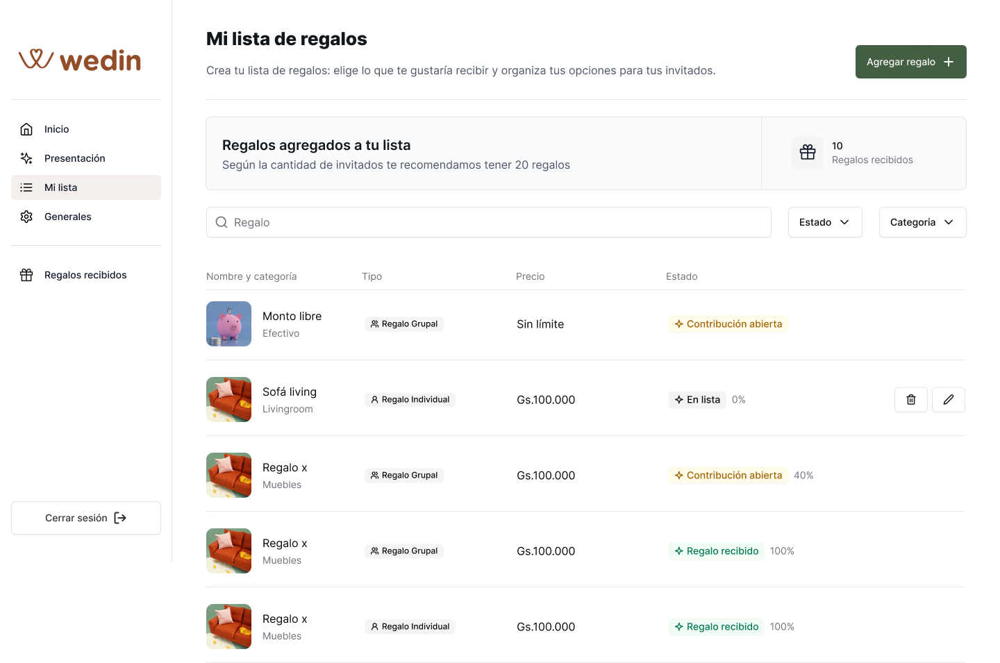
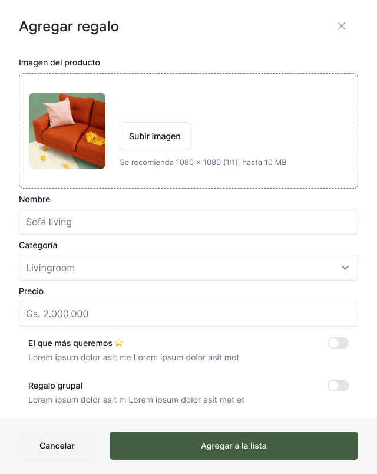

- New `actions/data/wishlist-gift.ts` (`'use server'`, mirrors
  `actions/data/gift.ts`'s shape): `getWishlistGifts`, `createWishlistGift`,
  `createWishlistGifts` (bulk), `editWishlistGift`, `deleteWishlistGift`,
  `getWishlistGift` (single lookup for "already in my list" badge state).
- Rewrite `app/(dashboard)/wishlist/page.tsx` /
  `components/dashboard/dashboard-wishlist.tsx` as an async Server
  Component (pattern: `dashboard-bank-details.tsx` — `getEvent()` then a
  data call, `Suspense` + `lazy()` client form/list) — real data replaces
  the current unconditional `EmptyState`.
- `app/(default)/gifts/page.tsx`: replace the hardcoded "No agregado" badge
  (line 109) with a real `isInWishlist` check per gift; wire "Agregar
  regalo" (line 113-116) to a client island calling `createWishlistGift`;
  wire "Crear regalo" (line 31-34, currently has no handler) to a new
  `components/dialog/create-gift-dialog.tsx` that calls the already-built
  but never-invoked `createGift` action, then `createWishlistGift`. Note:
  `getGifts()` (`actions/data/gift.ts:26`) hardcodes `isDefault: true` in
  its query — a newly created custom gift (`isDefault: false`) correctly
  won't reappear in this catalog list; it only needs to surface via
  `getWishlistGifts` on `/wishlist`, so no change needed there.
- New hook `hooks/dashboard/use-wishlist-gift.ts` (manual-loading pattern,
  matches `useUpdateBankDetails.ts`).
- Verify: adding a gift from `/gifts` makes it appear on `/wishlist` with
  correct favorite/group flags; removing it updates both views.

**Status: ✅ Done, plus a substantial post-implementation polish pass** driven
by manual review/feedback across several follow-up rounds. Everything below
was verified live (seeded test user + Playwright + direct DB checks), not
just typechecked.

Delivered as planned: `actions/data/wishlist-gift.ts`, `dashboard-wishlist.tsx`
rewrite (async Server Component + `Suspense`/`lazy()` list), `/gifts` wiring,
`hooks/dashboard/use-wishlist-gift.ts`.

Also added, beyond the original scope:
- `actions/data/category.ts` (`getCategories`) — needed for category
  `Select`s; not in the original plan text.
- **Gift image rendering was broken app-wide.** Seed data always had images
  (`faker.image.url()`); the bug was `getGifts`/`getGiftlists` never
  `include`-ing the `image` relation, and the UI never rendering it. Fixed
  in both places — any future list/table of `Gift`s should `include: {
  image: true }` from the start.
- **New route `/gifts/lists/[giftlistId]`** — the "Ver paquete" giftlist
  detail page didn't exist yet; built it (package summary, bulk "Agregar
  paquete completo", per-gift table). A natural extension of this phase,
  not originally scoped.
- **Confirm-before-add modal.** Clicking a catalog gift row (not just its
  button) now opens a pre-filled, editable "Agregar regalo" dialog
  (`components/dialog/add-existing-gift-dialog.tsx` +
  `components/dashboard/gift-row.tsx`) before it's added, instead of adding
  instantly.
- **Gift personalization pattern** (relevant to any future gift-editing
  UI): editing a catalog gift's name/price/category/image forks a
  personalized copy (`Gift.isEditedVersion: true`, `sourceGiftId`) rather
  than mutating the shared default catalog item — *unless* the linked gift
  is already a personal copy, in which case it edits in place (no
  duplicate proliferation on repeated edits). `GiftCreateSchema`/
  `createGift` and `editGift` were extended to support this (image upload
  via nested `image: { create/upsert }`, `sourceGiftId`). Used in both
  `add-existing-gift-dialog.tsx` and `edit-wishlist-gift-dialog.tsx`.
- **`/wishlist` and `/gifts` filters wired** (search, Estado, Categoria).
  `/wishlist` filters client-side against already-fetched data (small
  dataset, no round-trip needed); `/gifts` filters via URL search params
  (`components/dashboard/gifts-filter-bar.tsx`), since `getGifts`/
  `getGiftlists` already supported `name`/`category` params server-side.
- **Design pass**: shared badge components
  (`components/dashboard/gift-type-badge.tsx`, `gift-added-badge.tsx`,
  `gift-favorite-badge.tsx`) replacing plain icon+text. Fixed a bug where
  the Tipo column always showed "Regalo Grupal" (was reading
  `Gift.giftlistId`, which just means "belongs to a predefined package" —
  unrelated to individual/group funding, which is a `WishlistGift`-level
  concept that doesn't exist until a gift is actually added to someone's
  list). Removed a redundant duplicate "already added" indicator that
  appeared twice in the same row.
- **`app/not-found.tsx`** — no custom 404 existed anywhere in the app;
  added one (reuses `EmptyState` + the sidebar's wedin logo mark). Also
  fixed `getGiftlist()`, which used to `throw` on error instead of
  returning `null` (crashed with an unhandled Prisma error on a malformed
  ObjectId in the URL) — now matches the rest of the codebase's
  return-`null`-on-error convention, and the detail page redirects to
  `/gifts` instead of a raw 404.
- **Price validation bug fix**: `GiftFormSchema.price` validated string
  *length* (`max(10)`) while the error message claimed a numeric max of
  99,999,999 — anything up to ~10 digits silently passed. Now validates
  the actual numeric value via `.refine()`. Note:
  `TransactionCreateSchema.amount` and `CreateTransactionParams.amount`
  (`schemas/form.ts`, `schemas/params.ts`) have the identical bug but are
  unused until Phase 6 — worth the same fix when that phase wires them up.
- **`components/forms/common/price-input.tsx`** — new shared masked
  Guaraní-currency input (strips non-digits live, formats with `es-PY`
  thousand separators e.g. `2.000.000`). Reused across all three gift
  dialogs; reuse it for any future PYG amount input (e.g. Phase 6/8).

**Known gap discovered, not fixed (flagged, out of scope for this phase)**:
`tailwind.config.ts` never mapped the shadcn CSS-variable tokens (`primary`,
`input`, `ring`, etc.) that `styles/globals.css` defines. Pre-existing,
affects ~14 shadcn primitives project-wide — most of the app just never hit
it because it's styled with explicit custom Tailwind colors instead of the
shadcn defaults. Only patched locally for the new `Switch` component (uses
`success`/`gray200` instead of `primary`/`input`). Worth a real fix
(wiring the CSS vars into `tailwind.config.ts`) before adding more shadcn
components that lean on default theme colors.

### Phase 3 — Event URL/slug write-path
Small, blocks Phase 4.

- New action in `actions/data/event.ts`: `updateEventUrl(eventId, url)` —
  validate via `EventUrlFormSchema`, check uniqueness against `Event.url`,
  update, `revalidatePath`.
- New form + hook using `EventUrlFormSchema`, surfaced in event-settings
  (check Figma for placement — likely a "your site is at
  wedin.com/e/{url}" field near the other settings forms).
- Verify: setting a URL rejects duplicates with a friendly error; valid
  submission persists and is reflected in `getEventById`/new `getEventByUrl`.

**Status: ✅ Done**, live-verified (real login session, real dev DB, no
mocks), plus follow-up hardening beyond the original scope.

Delivered as planned: `updateEventUrl` action, `hooks/dashboard/use-event-url.ts`,
a "Dirección de tu evento" field placed top of `event-settings.tsx` (right
after Fecha del evento, confirmed with the user), prefixed `wedin.com/e/` —
**this is now the committed guest-route path for Phase 4**, see the
`/e/[slug]` correction in Verified Facts above.

Also fixed along the way (not originally scoped, discovered while starting
this phase):
- **The MongoDB sparse-index gotcha** (see Verified Facts above) — this is
  what caused the original "Error uploading event images" bug
  (`Image.giftId`), was proactively found and pre-fixed on `Event.url`
  before it could bite the new field, then resurfaced twice more: once when
  `Image.giftId`'s sparse flag reverted outside of `prisma db push` (cause
  not fully identified — confirmed `db push` itself doesn't revert it), and
  once on `User.email` (onboarding step 2's partner-user creation, which
  never sets an email). All three now documented in `schema.prisma` with
  manual reindex commands.
- **`updateProfileStepTwo` non-atomic write bug** (`actions/common/onboarding.ts`) —
  the primary-user update and partner-user create ran as two separate
  writes; if the second failed (e.g. the `User.email` sparse-index bug
  above), the first had already committed, silently advancing the user to
  onboarding step 3 with the partner's name lost. Now wrapped in
  `prismaClient.$transaction(...)` so both writes succeed or neither does.
- **`EventUrlFormSchema` hardened to be DNS-label-safe**: lowercase-normalize
  (`.transform()`), 63-char cap (down from 255), a proper DNS-label regex
  (alphanumeric start/end, no leading/trailing hyphen) replacing the old
  charset-only check, and a reserved-word blocklist (`www`, `app`, `api`,
  `admin`, `dashboard`, `wedin`, etc.). Not needed for the current
  path-based `/e/{slug}` routing — done so that a **future** move to
  `{slug}.wedin.app` subdomain routing (discussed, deferred — see below)
  doesn't require a data-model or validation rewrite, just a routing-layer
  change. Also fixed a real bug found in the process: `updateEventUrl`
  validated through the schema but then used the raw, un-normalized input
  for both the uniqueness check and the DB write, discarding the
  normalization.
- **Event-cover form reload anti-pattern removed** (`/event-details`,
  Presentación section — adjacent bug hunt, not Phase 3 itself): the form
  used to require a full page refresh after save to reset state; now the
  mutation response is used to explicitly sync `existingImages`/form state
  without reloading (see `hooks/dashboard/use-event-cover.ts`). Also fixed
  an unawaited-`Promise`-in-`.map()` bug in the same hook's image-replace
  path.

**Deferred, documented for later**: `{eventUrl}.wedin.app` subdomain routing
(instead of `wedin.com/e/{eventUrl}`) was evaluated and explicitly deferred.
Real upside (feels like "their own site," matches Notion/Substack-style
personalization), but real infra cost: wildcard DNS + wildcard TLS is a
hosting-provider dependency (e.g. Vercel's Wildcard Domains needs a paid
tier), needs the reserved-word blocklist above to avoid subdomain collisions
with real platform infrastructure, needs case-insensitive slug handling
(also done above), and preview/staging deployments don't get the wildcard
automatically. The schema hardening above keeps this option open cheaply;
actually building it is its own project, not part of this plan's phases.

### Phase 4 — Guest-facing public event site
Net-new route tree outside `(dashboard)`/`(default)`, never importing the
session-gated `getEvent()`.

**Reference (Figma)** — full guest flow in one frame: hero header, gift grid,
and the three "Agregar regalo" dialog states (fixed-price/group detail, monto
libre, cart):

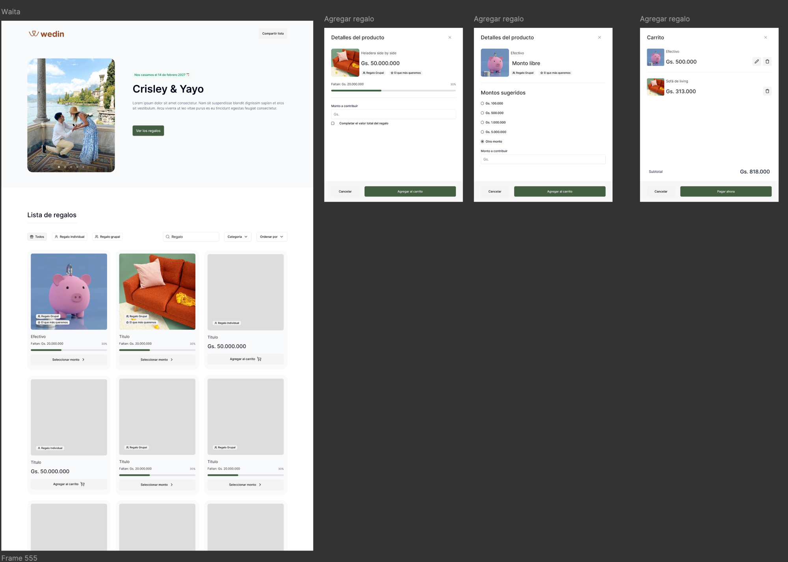

- New `actions/data/public-event.ts` (`'use server'`, deliberately no
  `getCurrentUser()` call anywhere in the file): `getEventByUrl(slug)` — new
  function, not a rename of `getEventById` — and `getPublicWishlistGifts(eventId)`.
  Kept as a separate file from `actions/data/event.ts` so no session-gated
  function can accidentally leak into the public route tree.
- `app/e/[slug]/page.tsx` — resolves via `getEventByUrl`; `notFound()`
  if missing or "unpublished" (define published = `url` set AND ≥1
  `WishlistGift` row, reused by Phase 9's checklist logic).
- **Hero section**: render `event.coverMessage` + `event.images` (the same
  fields edited on the dashboard's Presentación screen) plus couple name(s)
  and date, above the catalog — matches the reference frame's header
  ("Crisley & Yayo", "Nos casamos el 14 de febrero de 2027", welcome message,
  "Ver los regalos" CTA). Part of `getEventByUrl`'s payload, not a separate
  fetch.
- Gift catalog section reuses the `Category`-filter/grid-row UI pattern from
  `app/(default)/gifts/page.tsx`, plus the reference frame's type filter
  (Todos / Regalo individual / Regalo grupal) and search/sort controls.
  Group-gift progress = sum of `COMPLETED` transactions for that
  `WishlistGift` vs. `gift.price` (both stored as `String`, parse before
  comparing) — rendered as the "Faltan: Gs. X / 30%" progress bar shown on
  grouped/favorite cards in the reference.
- **Gift detail is a dialog, not a page** — corrects the earlier draft of
  this phase, which assumed an undesigned detail route. The reference frame
  shows it as an "Agregar regalo" `Dialog` opened from a card's
  "Seleccionar monto" / "Agregar al carrito" button, with two variants:
  - **Fixed-price / group gift**: product image, title, price, group/favorite
    badges, progress bar, a contribution-amount input, and a "Completar el
    valor total del regalo" checkbox (pay the remaining balance in full).
  - **Monto libre**: no product image/price — a "Montos sugeridos" radio
    list (Gs. 100.000 / 500.000 / 1.000.000 / 5.000.000 / "Otro monto" with a
    free-text input). The preset amounts match `Event.giftAmounts` /
    `GiftAmountsFormSchema`'s four `giftAmount1..4` fields (already in the
    schema, unwired) — this dialog is the consumer of that data, not a new
    input surface.
  Both variants end in "Cancelar" / "Agregar al carrito" — added lines are
  cart entries (Phase 5), not immediate transactions.
- `app/e/layout.tsx` — minimal public layout, no dashboard chrome.
- Verify: visiting `/e/{url}` in a logged-out/incognito browser renders
  the event (hero + catalog) without redirecting to `/login`; opening a gift
  card's dialog shows the correct variant (fixed-price vs. monto libre) and
  "Agregar al carrito" adds the right line item.

**Status: ✅ Done** for fixed-price/group gifts, live-verified (Playwright
against the real dev DB, disposable test event created and torn down in a
`finally`-equivalent cleanup step, not just typechecked).

Delivered as planned: `actions/data/public-event.ts` (`getEventByUrl`,
`getPublicWishlistGifts`, no `getCurrentUser()` import), `app/e/layout.tsx`
(wedin logo + "Compartir lista" clipboard-copy button, reusing the same
`w-icon.svg` mark as `app/not-found.tsx`), `app/e/[slug]/page.tsx`
(`notFound()` when the event is missing or has zero `WishlistGift` rows),
hero (`components/guest/guest-hero.tsx` + `guest-image-carousel.tsx`, couple
name derived from `users` — primary + secondary `isPrimary` flag, same
convention as `event-settings.tsx`), and the gift catalog
(`components/guest/guest-gift-catalog.tsx` + `guest-gift-card.tsx`) with the
Todos/Individual/Grupal type filter, search, category and sort controls, and
the fixed-price/group "Detalles del producto" dialog
(`components/dialog/gift-contribution-dialog.tsx`).

**Scope correction made live with the user, before writing code**: the plan
text assumed a schema/UI mechanism for "monto libre" gifts existed or would
be obvious, but nothing in `prisma/schema.prisma`, the live dev DB, or
`prisma/seed.ts` marks a `Gift` as open-amount cash (no `Dinero` category, no
boolean flag, `Gift.price` is a required `String`) — a real gap the plan
never resolved. Confirmed with the user to **skip the monto libre dialog
variant for this pass**. Only the fixed-price/individual card (direct
"Agregar al carrito", full price, no dialog) and the group-gift card
("Seleccionar monto" → contribution dialog with progress bar + "Completar el
valor total del regalo" checkbox) are built. **Follow-up needed before monto
libre can be built**: decide how a `Gift` is marked open-amount (a new
`Gift.isOpenAmount Boolean` field was the recommended option, discussed but
not yet decided) — this also blocks wiring `Event.giftAmounts` /
`GiftAmountsFormSchema`'s four preset amounts into any UI, since that data
has no consumer yet.

Also decided/found during implementation, not in the original plan text:
- **Cart is deliberately not persisted yet.** "Agregar al carrito" appends to
  a local `useState` array inside `guest-gift-catalog.tsx` (confirmed via
  toast + Playwright) with no drawer, sticky bar, or localStorage — those are
  explicitly Phase 5's scope (`hooks/use-cart-store.ts` Zustand + persist).
  Building real cart UI now would either duplicate or conflict with Phase 5's
  planned architecture.
- **Individual vs. group dialog dispatch**: re-reading the Figma frame
  closely, only group gifts open a dialog at all — a fixed-price individual
  gift's "Agregar al carrito" adds the full price directly, no dialog step.
  The plan's dialog spec only documents the dialog's *contents*, not this
  dispatch rule, so it's called out here explicitly for Phase 5+ to rely on.
- **Already-fully-paid gifts** (`WishlistGift.isFullyPaid`) show a "Regalo
  recibido" badge and hide the CTA entirely (both card types) — not in the
  Figma reference (which has no example of this state) but a real guest-facing
  gap without it: a guest could otherwise try to contribute to a gift that's
  already fully funded.
- Reused existing conventions rather than introducing new ones: native
  `<select>` filter dropdowns (matches `gifts-filter-bar.tsx` /
  `dashboard-wishlist-list.tsx`, sidesteps the known unmapped
  shadcn-theme-token gap noted in Phase 2 rather than hitting it a second
  time), `Checkbox` used as-is like `StepThree`/`StepFour` (same unmapped-token
  gap, not fixed here — out of scope for this phase), `Progress` bar
  component as already used in `dashboard-home.tsx`.
- **Verified date-of-week discrepancy while testing was a test-data artifact,
  not a code bug**: seeding the test event's `date` via `new Date('2027-02-14')`
  (UTC midnight) and then formatting it with `date-fns` `format()` (local time)
  in Paraguay's UTC-3 offset displays "13 de febrero" — but this exactly
  mirrors `event-settings.tsx`'s existing `format(field.value, 'PPP', ...)`
  pattern, and real dates come from the dashboard's `Calendar` picker
  (constructs a local-time `Date`, not a UTC-midnight one), so this isn't
  expected to reproduce from the real onboarding/event-settings flow — flagged
  here rather than silently fixed, in case a future phase touches date storage.

### Phase 5 — Cart (Zustand)
First real Zustand store in the codebase — `zustand` is installed and
`hooks/use-store.ts`'s hydration-safe wrapper exists, but zero stores exist
today; this phase sets the pattern.

- New `hooks/use-cart-store.ts` — `create(persist(...))`, localStorage key
  scoped per event (`wedin-cart-{eventId}`, since a guest could browse
  multiple couples' sites in one browser). Line-item `amount` kept as a
  `string` to match the `Transaction.amount`/`groupGiftParts` string
  convention noted above and avoid float rounding.
- Every client consumer goes through `useStore(useCartStore, selector)` per
  the existing hydration-safe contract in `hooks/use-store.ts` — this is
  the one genuinely new pattern to get right, since it's never been
  exercised in this repo.
- New `components/cart/` — drawer (`Dialog`, not `AlertDialog`, per
  convention), item row, header badge, plus a persistent sticky bottom bar
  while the catalog has ≥1 cart item: item count + cash total + a "Ver mi
  carrito" CTA (never a "pay" CTA at this layer). Full-page context, then a
  close-up of the confirmed design:

  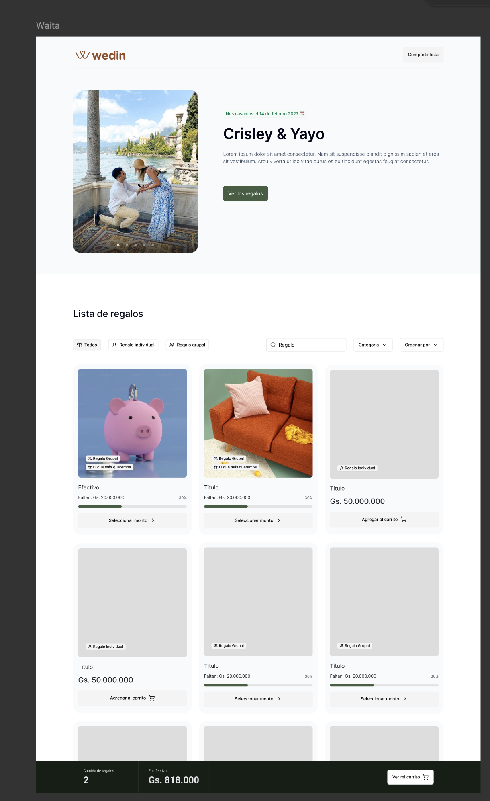
  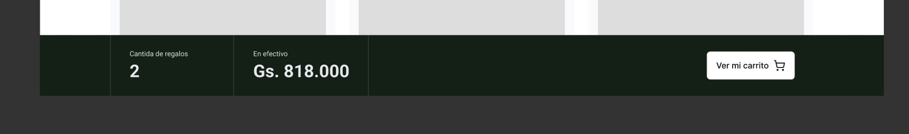

  Confirmed with the user: inside the "Carrito" dialog itself (Phase 4's
  frame), clicking "Agregar al carrito" / "Pagar ahora" on a line only adds
  it to the cart — it does not initiate payment despite the label. Actual
  checkout only begins from a deliberate next step (opening the full cart
  view via "Ver mi carrito"/"Ir al carrito", then proceeding to Phase 6's
  checkout page) — don't wire either dialog button directly to
  `createDlocalCheckoutSession`.
- Verify: adding/removing cart items persists across a page refresh
  (localStorage), scoped per event.

### Phase 6 — Checkout + dLocal Go integration
Largest phase. dLocal Go's API shape is now verified (see "dLocal Go API
research" above) — `POST /v1/payments` with `currency: "PYG"`, `country:
"PY"`; still needs a follow-up correction pass once real sandbox
credentials are available and a live call/webhook has actually been
exercised.

**Reference (Figma):**

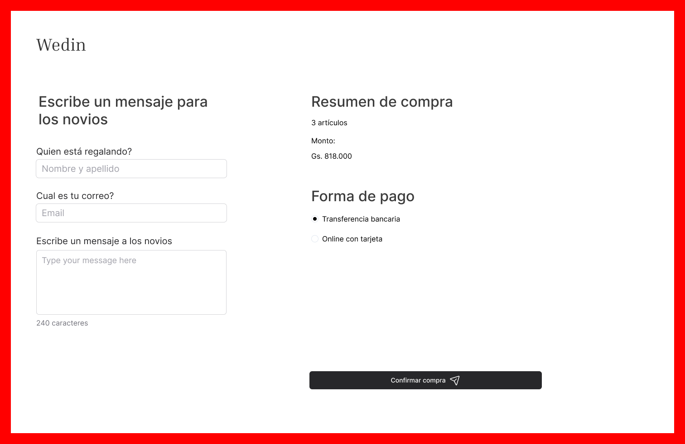
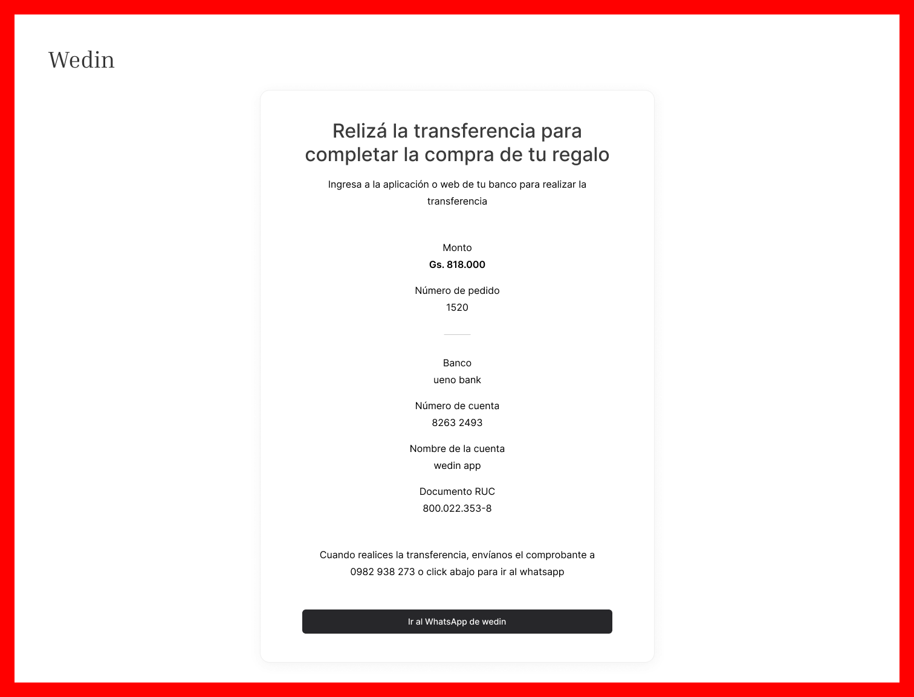
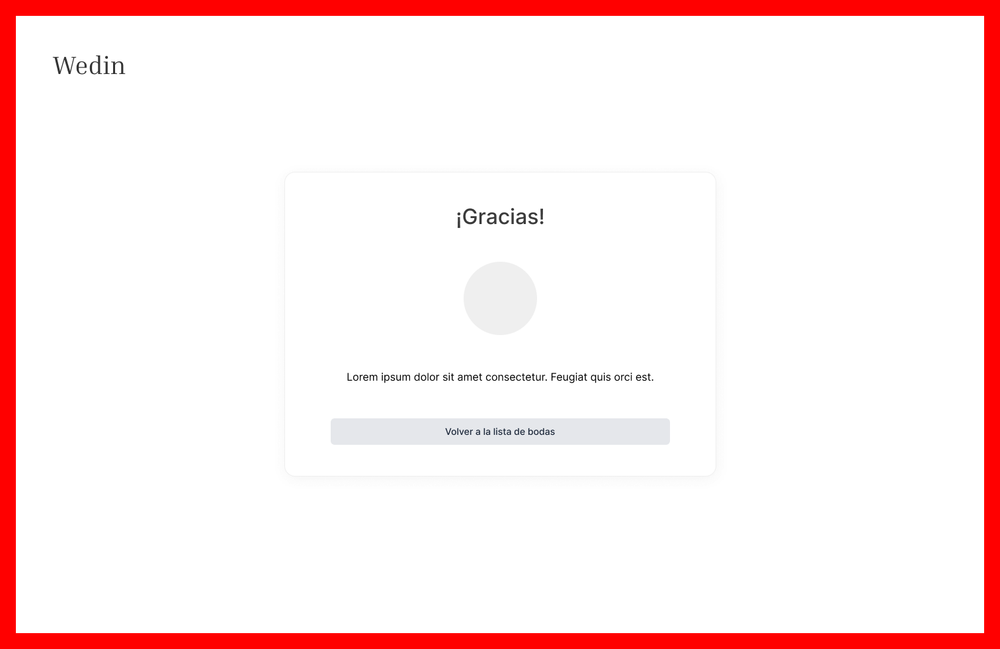

- New `schemas/checkout.ts`: `GuestCheckoutSchema` (`payerName`,
  `payerEmail`, cart line items).
- New `actions/data/checkout.ts`:
  - `createTransactionsForCart` — creates `OPEN` `Transaction` rows per
    cart line with `payerName`/`payerEmail` (Phase 1), `payerRole: INVITEE`,
    `payeeRole: ORGANIZER` (both already the schema defaults).
  - `createDlocalCheckoutSession` — calls dLocal Go to create a checkout
    session for the total, persists the returned reference onto
    `dlocalPaymentId`, returns the redirect URL.
- New `lib/dlocal.ts` — server-only wrapper following the
  `actions/upload-to-s3.ts` convention exactly: instantiate the client at
  module scope from `process.env.*`, no config abstraction layer. New env
  vars (none exist today): `DLOCAL_GO_API_KEY`, `DLOCAL_GO_SECRET_KEY`.
  No separate webhook secret exists — per the research above, the
  `V2-HMAC-SHA256` webhook signature is computed from the same API key +
  secret key already used for request auth (`HMAC-SHA256(ApiKey + rawBody,
  SecretKey)`), so `DLOCAL_GO_WEBHOOK_SECRET` is not a real dLocal Go
  concept and should not be added.
- New `app/e/[slug]/checkout/page.tsx` +
  `hooks/checkout/use-checkout.ts` (RHF + `zodResolver(GuestCheckoutSchema)`,
  manual-loading pattern per convention).
- New webhook route `app/api/webhooks/dlocal/route.ts` — repo's
  second-ever API route. The incoming POST body is only
  `{"payment_id": "..."}` — the handler must call back
  `GET /v1/payments/:payment_id` to learn the real `status` before doing
  anything (see research above). On `status: "PAID"`: look up
  `Transaction` by `dlocalPaymentId`, set `COMPLETED`, write a
  `TransactionStatusLog` with `changedById: null` (Phase 1's schema
  change), recompute `WishlistGift.isFullyPaid` (sum `COMPLETED`
  transactions vs. `gift.price`; for `isGroupGift`, increment
  `groupGiftParts` — parse the string, don't reinterpret as Int — and mark
  paid only once the sum covers the price). Must be idempotent (no-op if
  already `COMPLETED`), since dLocal retries non-200 responses every 10
  minutes for up to 30 days. Verify the `V2-HMAC-SHA256` signature
  (`HMAC-SHA256(ApiKey + rawJsonBody, SecretKey)`, header
  `Authorization: V2-HMAC-SHA256, Signature: <hex>`) against the **raw**
  request body — call `request.text()` before `JSON.parse`.
- Still deferred to implementation time (needs a real sandbox account to
  confirm): exact PYG amount rounding/decimals in a live response, refund
  request/response shape (`create-a-refund`/`retrieve-a-refund` pages
  weren't read in this pass), idempotency-key support for double-click
  checkout protection, and the contents of `errors.md`/`rate-limits.md`
  for `lib/dlocal.ts`'s error handling.
- Verify: a full guest checkout in dLocal Go's sandbox/test mode ends with
  the `Transaction` flipping to `COMPLETED` via the webhook, and
  `WishlistGift.isFullyPaid` updates correctly for both individual and
  group gifts (test group-gift partial payment specifically);
  double-submitting the same webhook payload manually confirms
  idempotency.

### Phase 7 — Regalos recibidos ledger + "Agradecer"

**Reference (Figma):**

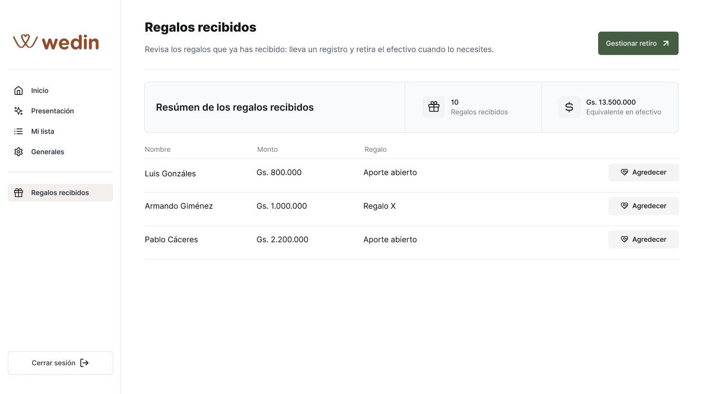

- New `actions/data/transaction.ts`: `getTransactions` (using
  `GetTransactionsParams`), `updateTransactionNotes` (using
  `TransactionEditSchema` — must pass the transaction's current `status`
  through alongside the new `notes`, since the schema requires it).
- Open product question to confirm before building this one sub-feature:
  does "Agradecer" mean a thank-you note stored on `Transaction.notes`, or
  a transactional email to `payerEmail` via the already-installed
  `resend`/`nodemailer`? Check the Figma flow; if unresolved, implement
  the `notes`-only version first (cheaper, reversible) and flag the email
  variant as a follow-up.
- Rewrite `components/dashboard/dashboard-transactions.tsx` as an async
  Server Component (same conversion pattern as Phase 2), real CSS-grid
  rows instead of the static `EmptyState`.
- Verify: completed transactions appear on `/transactions` ordered by
  date; "Agradecer" performs whichever confirmed behavior.

### Phase 8 — Wallet balance + withdrawal ("Enviar a mi cuenta")

Manual-admin-processed for MVP: `BankDetails` has zero gateway account
tokens today — it's built for a human to read and act on, not an API
target. Automated multi-country payout is a separate integration surface;
don't bundle it into this phase.

**Reference (Figma)** — accessed via a "Mi perfil" profile-menu route
rather than the dashboard sidebar (consistent across all 4 design
variants of this screen, not a stale iteration):

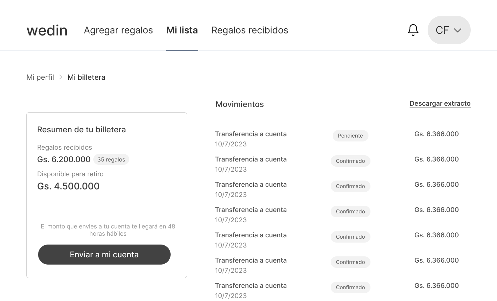

- `getEventBalance(eventId)` — sum `COMPLETED` transaction amounts minus
  sum of non-`REJECTED` `Payout` amounts (Phase 1's model).
- New `actions/data/payout.ts`: `getPayouts`, `requestPayout` (validates
  `amount <= balance`, creates a `Payout` row with `status: REQUESTED` —
  does **not** call any transfer API; an operator flips status by hand
  later, or via a future admin-gated route). **Do not** rely on
  `adminRoutes`/`isAdminRoute` in `middleware.ts` as real protection for
  that future route — it's dead code today (see Verified Facts); fix the
  `console.log` into an actual redirect first if/when that route is built.
- New `components/dialog/request-payout-dialog.tsx` wired to the existing
  no-op "Gestionar retiro" button in `dashboard-transactions.tsx`.
- New `components/dashboard/wallet-balance-card.tsx`.
- Verify: `requestPayout` rejects an amount greater than the computed
  balance; the balance correctly excludes already-requested payouts.

### Phase 9 — Dashboard home real progress tracking
Lowest complexity, highest visible payoff — buildable any time after
Phase 3, in parallel with 4-8.

**Reference (Figma):**

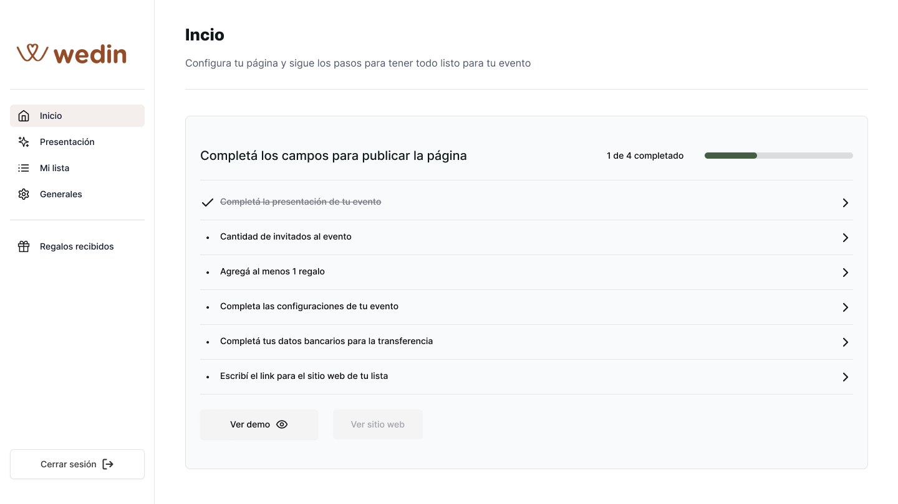

- Rewrite `components/dashboard/dashboard-home.tsx` as an async Server
  Component. Replace every hardcoded checklist row (lines 28-95 today)
  with a real condition: presentación (`coverMessage` + images), guest
  count (`event.guests`, already exists), ≥1 gift (Phase 2's
  `getWishlistGifts` count), event config (existing
  `date`/`country`/`city`/`partnerName`), bank details
  (`!!getBankDetails()`), site URL (`!!event.url`, Phase 3). Compute the
  real `X / 6` progress bar (currently hardcoded "1 de 6" / `value={26}`).
  Enable "Ver sitio web" (currently `disabled`) once `event.url` is set,
  linking to `/e/{url}`.
- Verify: toggling each underlying condition (adding a gift, setting bank
  details, setting the URL, etc.) updates the corresponding checklist row
  and the progress bar.

## Recommended build order

**1 → 2 → 3 → 4 → 5 → 6 → 7 → 8**, with **9** slotted in any time after
Phase 3 (good candidate to do second, for a visible win before the public
site work).

## Critical files
- `prisma/schema.prisma`
- `schemas/form.ts`, `schemas/params.ts` (reuse existing schemas, don't recreate)
- `actions/data/event.ts`, `actions/data/gift.ts`, `actions/upload-to-s3.ts` (patterns to mirror)
- `hooks/use-store.ts` (cart hydration pattern), `hooks/dashboard/useUpdateBankDetails.ts` (form-hook pattern)
- `middleware.ts`, `lib/routes.ts` (no changes needed for the new public route; admin gate is broken, noted above)
- `components/dashboard/dashboard-home.tsx`, `dashboard-transactions.tsx`, `dashboard-wishlist.tsx`
- `app/(default)/gifts/page.tsx` (list/row convention to reuse)
- From Phase 2's polish pass, reusable in later phases (esp. Phase 4's
  guest-facing gift browsing): `components/dashboard/gift-type-badge.tsx`,
  `gift-added-badge.tsx`, `gift-favorite-badge.tsx` (pill badge
  conventions), `components/forms/common/price-input.tsx` (masked Gs.
  input), `components/dashboard/gifts-filter-bar.tsx` (URL-searchParams
  filter bar pattern), `app/not-found.tsx` (custom 404, now exists)